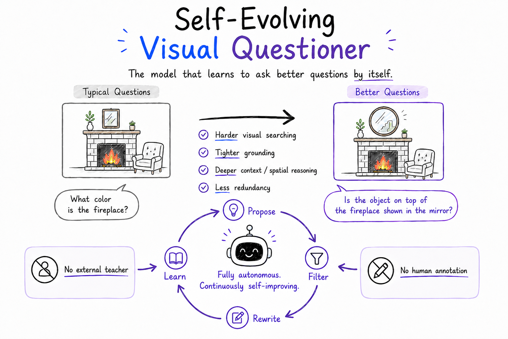
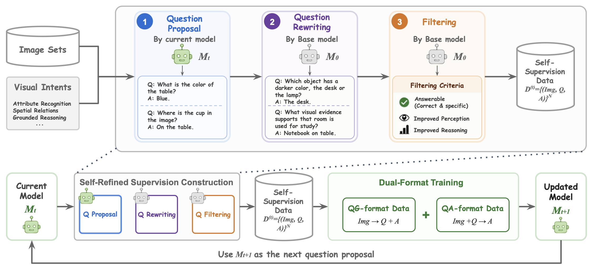

# Self-Evolving Visual Questioner


Official code for the paper **Self-Evolving Visual Questioner**.

[**Paper**](https://arxiv.org/abs/2606.13929) | [**Project Page**](https://joliang17.github.io/SelfEvolvingVQG/)


## Highlights

🔄 Fully Autonomous Self-Evolution: A novel framework where the VLM acts as both the proposer and filter. It continuously bootstraps harder, more visually grounded questions entirely from unlabeled images.

🚫 Zero External Reliance: Achieves state-of-the-art visual questioning capabilities without requiring expensive human annotations or proprietary external teacher models (like GPT-4V).

📏 New Agentic Evaluation Protocol: Introduces a comprehensive evaluation paradigm to assess visual question generation (VQG) across distinct cognitive dimensions: visual search difficulty, evidence coverage, context reasoning, spatial reasoning, and diversity.


## Method Overview


**SelfEvolvingVQ** provides a complete, end-to-end pipeline for autonomously proposing, refining, and evaluating visually grounded questions. The repository is structured around two core workflows:

* **Self-Evolving Proposing & Filtering:** A fully automated loop that generates seed visual questions from unlabeled images, iteratively rewrites them to demand deeper cognitive reasoning, and rigorously filters them using the VLM itself as a judge.

* **Agentic Quality Evaluation:** A comprehensive evaluation suite designed to assess VQG capabilities. It uses an image-capable OpenAI evaluator to score questions across four critical cognitive dimensions (visual search, evidence coverage, context, and spatial reasoning), alongside Qwen embedding models to measure dataset-level diversity.

## Repository Structure

```text
SeeQ/
|-- config/
|   |-- key.conf.example
|   `-- task_definition.json
|-- gen/
|   |-- run_cmd_sat_3b.sh
|   `-- scripts/generation_pipeline.py
|-- eval/
|   |-- run_qs_gene.sh
|   |-- run_qs_eval.sh
|   |-- run_qs_diversity.sh
|   `-- question/
`-- utils/
```

## Setup

Local secrets can be provided through environment variables or
`config/key.conf`.

```bash
cp config/key.conf.example config/key.conf
export OPENAI_API_KEY=...
```

## Inputs

Set `JSON_FILE` to the external input JSON before running generation scripts.

```bash
export JSON_FILE=/path/to/questions.json
```

Model checkpoints, datasets, caches, and generated outputs are intentionally not
included in this repository.

## Evaluation Pipeline

### 1. Self-Evolving Question Generation

Run the main self-evolving generation pipeline:

```bash
bash gen/run_cmd_sat_3b.sh
```

Useful environment variables:

```bash
export JSON_FILE=/path/to/questions.json
export MODEL_TYPE=qwen25_3b
export MODEL_PATH=/path/to/local/checkpoint        # optional
export FILTER_MODEL_TYPE=qwen25_3b
export OUTPUT_FOLDER=pipeline_rag_sat_2nd_3b_part
export RAG_BANK=output/rag/sample_questions_2nd.jsonl
export FACT_CACHE=output/rag/facts
export FILTER_MODE=filtered
export EVOLUTION_MODE=evolved
export NUM_TURN=1
```

The Slurm launcher partitions the input into5 array jobs by default. For a
single local test run, set `SLURM_ARRAY_TASK_ID` manually:

```bash
SLURM_ARRAY_TASK_ID=0 bash gen/run_cmd_sat_3b.sh
```

### 2. Baseline Question Generation

Generate image-grounded question-answer pairs with Qwen models:

```bash
bash eval/run_qs_gene.sh
```

Useful environment variables:

```bash
export JSON_FILE=/path/to/questions.json
export MODEL_TYPE=qwen25_3b       # qwen25_3b, qwen25_7b, qwen3_4b
export MODEL_PATH=/path/to/model  # optional alternative to MODEL_TYPE
```

Outputs are written under `output/eval/question_gene/` by default.

### 3. Validity and Difficulty Evaluation

Submit OpenAI batch evaluation jobs:

```bash
MODEL_NAME=<model_name> RUN_NAME=<run_name> bash eval/run_qs_eval.sh submit
```

Check job status:

```bash
MODEL_NAME=<model_name> RUN_NAME=<run_name> bash eval/run_qs_eval.sh status
```

Collect completed results:

```bash
MODEL_NAME=<model_name> RUN_NAME=<run_name> bash eval/run_qs_eval.sh collect
```

Normalize generated questions without API submission:

```bash
MODEL_NAME=<model_name> RUN_NAME=<run_name> bash eval/run_qs_eval.sh normalize
```

Useful environment variables:

```bash
export INPUT_DIR=output/eval/question_gene
export OUTPUT_DIR=output/question_eval/valid_difficulty
export JUDGE_MODEL=gpt-5-mini
export NUM_IMAGES=100
```

### 4. Embedding Diversity Evaluation

Compute embedding-based diversity for generated questions:

```bash
MODEL_NAME=<model_name> bash eval/run_qs_diversity.sh
```

Useful environment variables:

```bash
export INPUT_JSON=output/eval/question_gene/<model_name>.json
export OUTPUT_DIR=output/eval/question_embedding_diversity
export EMBEDDING_MODEL=Qwen/Qwen3-Embedding-4B
export BATCH_SIZE=8
```

## Citation

```bibtex
@misc{liang2026selfevolvingvisualquestioner,
      title={Self-Evolving Visual Questioner}, 
      author={Yijun Liang and Hengguang Zhou and Ming Li and Lichen Li and Cho-Jui Hsieh and Tianyi Zhou},
      year={2026},
      eprint={2606.13929},
      archivePrefix={arXiv},
      primaryClass={cs.CV},
      url={https://arxiv.org/abs/2606.13929}, 
}
```
